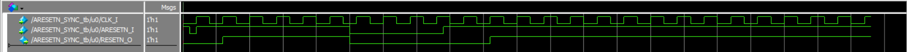

# ARESETN_SYNC
Asynchronous Reset (Active LOW) Synchronizer Module.

## File List
| No. |File name|Description|
|:---:|:-------------------------|:----------|
|  1  |[ARESETN_SYNC.v](./ARESETN_SYNC.v)|Asynchronous reset synchronizer module|
|  2  |[ARESETN_SYNC_tb.sv](./ARESETN_SYNC_tb.sv)|Testbench for ARESETN_SYNC.v|
|  3  |[README.md](./README.md)|README file.|
|  4  |[coverage_report.txt](./coverage_report.txt)|Code coverage report.|
|  5  |[Timing_charts](./Timing_charts)|Timing chart directory for README.md|

## Status
|Item|Status|
|:------|:---------|
|Version|1.02|
|Date   |2025/03/23|
|Simulated|Yes|
|Real Machine Checked|Yes|

## Verified Devices
|No.|FPGA Vendor|Device|Board|
|:-:|:----------|:-----|:----|
|1|Altera|Cyclone 10 LP 10CL025YU256I7G|[EK-10CL025U256](https://www.intel.com/content/www/us/en/products/details/fpga/development-kits/cyclone/10-lp-evaluation-kit.html)|
|2|Altera|Cyclone IV E EP4CE22F17C6N|[DE0-Nano](https://www.terasic.com.tw/cgi-bin/page/archive.pl?No=593)|
|3|Altera|MAX 10 10M50DAF484C7G|[DE10-Lite](https://www.terasic.com.tw/cgi-bin/page/archive.pl?Language=English&CategoryNo=234&No=1021)|
|4|Efinix|Trion T20F256I4|[T20 BGA256 Development Kit](https://www.efinixinc.com/products-devkits-triont20.html)|

## Port Definition
### Input
|Port name|Description|
|:--------|:----------|
|CLK_I|Clock.|
|ARESETN_I|Asynchronous reset (Active Low).|

### Output
|Port name|Description|
|:--------|:----------|
|RESETN_O|Reset Output (Synchronized when it negated.)|

## Parameters
|Parameter name|Description|
|:-------------|:----------|
|STAGES|Synchronization Stage Length (Default: 2).|

## Timing Chart
### Input
N/A
### Output
N/A
### Sequence

## Version History
### v1.01
- Commit to this repository. (2024/12/22)
### v1.02
- Change moddule name from "NRST_SYNCHRONIZER" to "ARESETN_SYNC" (2025/03/23).
- Change testbench from Verilog to SystemVerilog (2025/03/23).
- Add sequence chart (2025/03/23).
- Update the Input & Output timing chart (2025/05/03).
- Real Machine Checked (2025/06/28).
