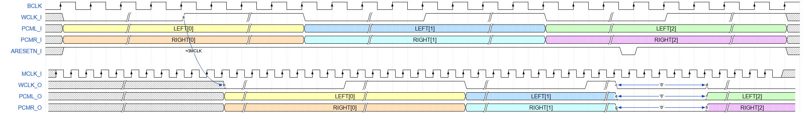

# PCM_MCLK_SYNC
PCM Data Synchronizer w/ MCLK.

## File List
| No. |File name|Description|
|:---:|:-------------------------|:----------|
|  1  |[PCM_MCLK_SYNC.v]()|PCM Data Synchronizer w/ MCLK.|
|  2  |[PCM_MCLK_SYNV_tb.sv]()|Testbench for PCM_MCLK_SYNC.v|
|  3  |[PCM_1kHz_44100fs_32bit.txt]()|Input data file for simulation (sine wave).|
|  4  |[README.md]()|README file.|
|  5  |[coverage_report.txt]()|Code coverage report.|

## Status
|Item|Status|
|:------|:---------|
|Version|1.00|
|Date   |2025/06/26|
|Simulated|Yes|
|Real Machine Checked|Yes|

## Verified Devices
|No.|FPGA Vendor|Device|Board|
|:-:|:----------|:-----|:----|
|1|Altera|Cyclone 10 LP 10CL025YU256I7G|[EK-10CL025U256](https://www.intel.com/content/www/us/en/products/details/fpga/development-kits/cyclone/10-lp-evaluation-kit.html)|
|2|Altera|Cyclone IV E EP4CE22F17C6N|[DE0-Nano](https://www.terasic.com.tw/cgi-bin/page/archive.pl?No=593)|

## Port Definition
### Input
|Port name|Description|
|:--------|:----------|
|MCLK_I|Master clock|
|WCLK_I|PCM word clock|
|PCML_I|PCM left data|
|PCMR_I|PCM right data|
|ARESETN_I|Asynchronous reset (Active Low).|

### Output
|Port name|Description|
|:--------|:----------|
|WCLK_O|Synchronized PCM word clock|
|PCML_O|Synchronized PCM left data|
|PCMR_O|Synchronized PCM right data|

## Parameters
|Parameter name|Description|
|:-------------|:----------|
|DATA_WIDTH|PCM data bit length (Default: 32).|

## Timing Chart

## Version History
### v0.10
- Initial Commit (2025/06/22).
### v1.00
- Real machine checked (2025/06/26).
